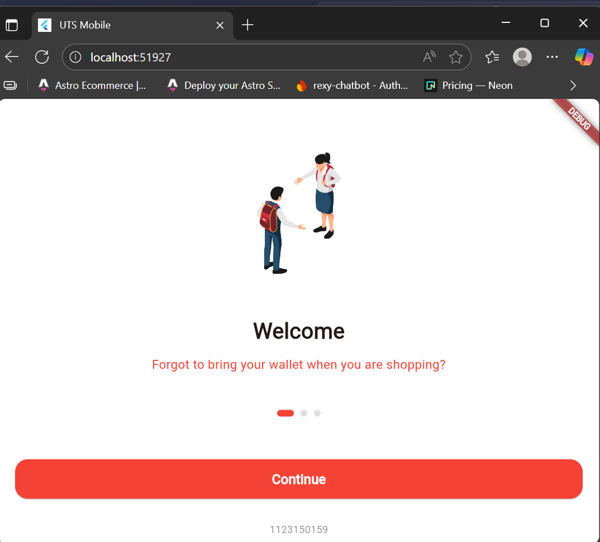
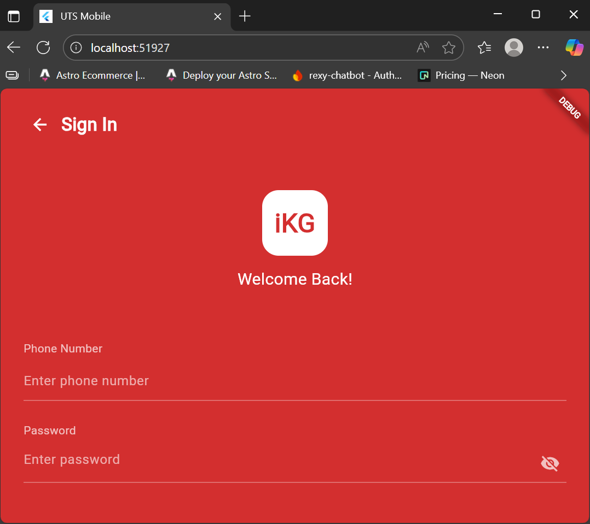

# TUGAS UTS

## SCREENSHOT

<p align="center">
  
  
</p>

## Identitas

- **Nama Lengkap:** Aditya Putra Perdana
- **NIM:** 1123150159
- **Mata Kuliah / Proyek:** Pemrograman Mobile

## Cara Menjalankan Project

1. Pastikan sudah menginstal **Flutter SDK** minimal versi 3.x.x
2. Clone atau download repository project ini:
   ```bash
   git clone https://github.com/kbdevs12/kb1179-1123150159-uts.git
   cd flutter-onboarding-login
   ```
3. Install semua depedency:

```bash
flutter pub get
```

4. run:

```bash
flutter run
```
